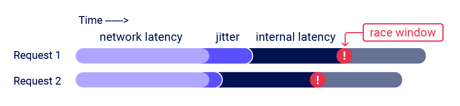
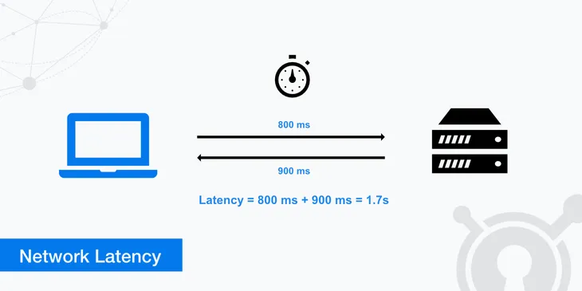
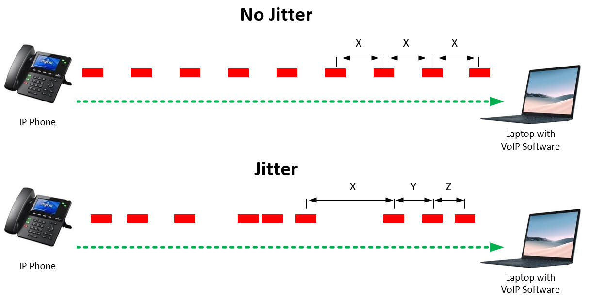

# Race Conditions

## What are race condition vulnerabilities?

Race conditions are a common type of vulnerability related to business logic flaws. They happen when a system or application handles multiple requests at the same time without proper safeguards. This allows different threads to interact with the same data simultaneously, causing unintended behavior. A race condition attack exploits this by sending carefully timed requests to create collisions and take advantage of the resulting unpredictable behavior for malicious purposes.

## How do race condition vulnerabilities arise?

Race condition vulnerabilities arise when a system or application processes multiple threads or requests concurrently without proper synchronization. These vulnerabilities can be exploited by attackers who craft and time their requests to trigger the race condition, leading to unintended and often harmful behavior in the system:

1. **Shared resource access**: when multiple threads or processes access shared resources (e.g., files, variables, or memory) simultaneously without proper locking mechanisms, it can cause inconsistent or corrupted data states.

2. **Time of check to time of use (TOCTOU)**: this occurs when there is a gap between checking a condition (e.g., verifying user permissions) and using the result of that check (e.g., performing an action based on those permissions). An attacker can exploit this gap to change the conditions and bypass security checks.

3. **Inadequate locking mechanisms**: when the system does not implement adequate locking or synchronization mechanisms, it can lead to multiple threads modifying the same data concurrently, causing data corruption or unintended behavior.

4. **Poorly designed code**: race conditions often arise from poorly designed code where the developer did not anticipate concurrent execution or failed to implement proper synchronization mechanisms.

## What is the impact of race condition vulnerabilities?

The impact of race condition vulnerabilities can be significant and varied, depending on the context in which they occur:

1. **Data corruption**: concurrent access to shared resources without proper synchronization can lead to data inconsistencies or corruption, affecting the integrity of the system.

2. **Security bypasses**: attackers can exploit race conditions to bypass security mechanisms, such as authentication and authorization checks, leading to unauthorized access to sensitive data or system functionalities. For example, bypassing an anti-bruteforce rate-limit or reusing a single CAPTCHA solution multiples times.

3. **Business logic violations**: exploiting race conditions can allow attackers to violate business logic like redeeming a gift card multiple times, repeatedly applying a single discount code or rating a product multiple times.

4. **Denial of service**: race conditions can cause systems to behave unpredictably or crash, leading to denial of service, where legitimate users are unable to access the system or service.

5. **Financial loss**: in applications handling financial transactions, race conditions can result in incorrect transactions, duplicate charges, or unauthorized fund transfers, leading to financial losses for users and organizations. For example, withdrawing or transferring cash in excess of your account balance.

6. **Privilege escalation**: exploiting race conditions can allow attackers to escalate their privileges, gaining higher-level access and control over the system than intended.

## How to test for race condition vulnerabilities?

The primary challenge when testing for race conditions is timing the requests so that at least two race windows line up, causing a collision. This window is often just milliseconds and can be even shorter. Even if you send all of the requests at exactly the same time, in practice there are various uncontrollable and unpredictable external factors that affect when the server processes each request and in which order.

### Sub-state

Sub-state refers to the intermediate states or conditions that a system or process goes through while transitioning from one stable state to another.

These sub-states are critical because race conditions often exploit the brief moments when the system is in these intermediate states. During these sub-states, multiple threads or processes might concurrently access shared resources, leading to unpredictable and potentially harmful behavior if proper synchronization is not enforced.

Imagine a banking application that allows users to transfer money. When "User A" initiates a transfer, the system first checks if the account has sufficient funds (sub-state) before proceeding with the transfer. In a race condition scenario, "User B", acting simultaneously, initiates a similar transfer from the same account. Both requests reach the system at almost the same time, both see sufficient funds, and both proceed with the transfer, resulting in an overdrawn account. This happens because the critical sub-state was not adequately synchronized.

### Factors that affect the exploitation of race condition vulnerabilities

Many things might affect the time it takes from a request to reach the destination server and receive its response back. Unfortunately most of them are out of our control but we can use different techniques to minimize their impact. The image below illustrates how two parallel requests sent at the same time experience different stages of latency:



The critical area, marked as the "race window," shows where the timing overlap occurs, leading to a race condition. The red exclamation marks highlight the points where the race condition can cause unintended behavior due to concurrent data access.

#### Network latency

Network latency refers to **the time it takes for data to travel from its source to its destination across a network**. It's usually measured in milliseconds (ms).

Imagine you're sending a message to a friend in another country via a messenger. Network latency is the time from when you press "send" on your phone until your friend's phone receives the message. If the network latency is high, there might be a noticeable delay before your friend sees the message.



#### Jitter

Jitter involves the variation in packet arrival time. It's **a measure of the consistency of latency**. In simpler terms, if latency is how long it takes for packets to reach their destination, **jitter is how much those times vary from packet to packet**.

Consider a video call. If every piece of data (video frame, audio packet) arrives at a regular interval, you'll see a smooth conversation. But if some packets get delayed more than others (because of varying latencies), you'll notice glitches or interruptions in the video or audio. This inconsistency is jitter.



#### Internal latency

Internal latency refers specifically to **delays within a network system or device**, rather than delays caused by the physical distance the data must travel. This could be due to processing times within network devices like routers or switches.

When you access a website, your data passes through several devices on your local network before reaching the internet. If your router is old or overwhelmed with traffic, it might slow down the processing of your data, adding to the overall latency. This delay caused by your router is a type of internal latency.

#### Race window

**The period of time during which a collision is possible** is known as the "race window". This could be the fraction of a second between two interactions with the database, for example.

#### Delays introduced by network architecture

For example, there may be a delay whenever the front-end server establishes a new connection to the back-end. The protocol used can also have a major impact.

#### Delays introduced by endpoint-specific processing

Different endpoints inherently vary in their processing times, sometimes significantly so, depending on what operations they trigger.

### Ways to overcome the factors that affect the exploitation of race condition vulnerabilities

There are multiple techniques that allow us to minimize the affect of some of the latencies, most of them try to deal with jitter. No technique is ideal and doesn't guarantee to work every single time but can work after a few attempts.

#### Last-byte synchronization attack

Last-byte synchronization attack exploits the fact that **the web server won't start to process a request until the whole request has arrived** so by withholding the final bite and putting that in a separate packet you make the final packet of each request really small and kind of make things a little bit more reliable. In other words **by synchronizing the sending of the last byte of each request we force them to be processed at the same time**.

The main drawback is that this method requires precise timing, which can be difficult to achieve consistently due to variations in network latency and system processing times. This makes it less reliable for detecting race conditions under varying real-world conditions like jitter.

#### Single-packet attack

The single-packet attack enables you to completely neutralize interference from network jitter by using **a single TCP packet to complete twenty to thirty requests simultaneously**. Although you can often use just two requests to trigger an exploit, sending a large number of requests like this helps to mitigate internal latency, also known as server-side jitter.

This attack is 4 to 10 times more effective than the last-byte synchronization attack. This is possible due to the fact that `HTTP/2` allows HTTP requests to be sent over a single connection concurrently, whereas in `HTTP/1.1` they have to be sequential.

Web servers often delay requests that are sent too quickly and that means that you can send a single packet with a whole load of dummy requests in the middle of it which will cause a server side delay and mean that when your fast processing request at the end is reached it lines everything up perfectly so because with this everything is reaching the server at the same time and the server is injecting the delay for us network jitter is no longer going to make the attack fail.

This attack utilizes Nagle's algorithm to exploit race conditions.

It is designed to **reduce network congestion by combining multiple small outgoing messages into a single packet**. The attack leverages this behavior to send a carefully timed packet that splits into multiple parts due to the algorithm's buffering. This split timing can align the critical section of concurrent requests, increasing the likelihood of triggering a race condition vulnerability.

The main drawback is that this method requires `HTTP/2` to be supported by the web server.

#### Connection warming

Back-end connection delays don't usually interfere with race condition attacks because they typically delay parallel requests equally, so the requests stay in sync. It's essential to be able to distinguish these delays from those caused by endpoint-specific factors.

One way to do this is by "warming" the connection with one or more inconsequential requests to see if this smoothes out the remaining processing times. In Burp Repeater, you can try adding a `GET` request for the homepage to the start of your tab group, then using the "Send group in sequence (single connection)" option.

If the first request still has a longer processing time, but the rest of the requests are now processed within a short window, you can ignore the apparent delay and continue testing as normal.

If you still see inconsistent response times on a single endpoint, even when using the single-packet technique, this is an indication that the back-end delay is interfering with your attack. You may be able to work around this by using Turbo Intruder to send some connection warming requests before following up with your main attack requests.

#### Abusing rate or resource limits

If connection warming doesn't make any difference, there are various solutions to this problem.

Using Turbo Intruder, you can introduce a short client-side delay. However, as this involves splitting your actual attack requests across multiple TCP packets, you won't be able to use the single-packet attack technique. As a result, on high-jitter targets, the attack is unlikely to work reliably regardless of what delay you set.

Instead, you may be able to solve this problem by abusing a common security feature.

Web servers often delay the processing of requests if too many are sent too quickly. By sending a large number of dummy requests to intentionally trigger the rate or resource limit, you may be able to cause a suitable server-side delay. This makes the single-packet attack viable even when delayed execution is required.

### Exploit race condition vulnerabilities with Burp Suite

#### Burp Repeater

Burp Suite (starting from version 2023.9) adds powerful new capabilities to Burp Repeater that enable you to easily send a group of parallel requests in a way that greatly reduces the impact of the network jitter.

To send a group of requests:

1. Create a Repeater tab group and add the relevant tabs to it. Alternatively, you can create a group and duplicate tabs within it. This can be helpful if you're testing for race condition vulnerabilities as it makes the process of creating identical requests much more efficient.

2. Select one of the tabs in the group.

3. Click the drop-down arrow by the side of the Send button and select one of the available options:
    - Send group in sequence (single connection).
    - Send group in sequence (separate connections).
    - Send group in parallel.

4. Click Send group. Repeater sends all of the requests from the grouped tabs.

##### Sending requests in sequence

You can send requests in sequence using either a single connection or multiple connections.

To send a sequence of requests, the group must meet the following criteria:

- There must not be any WebSocket message tabs in the group.
- There must not be any empty tabs in the group.

###### Sending over a single connection

Repeater establishes a connection to the target, sends the requests from all of the tabs in the group, and then closes the connection. Sending requests over a single connection enables you to test for potential client-side desync vectors. It also reduces the jitter that can occur when establishing TCP connections. This is useful for timing-based attacks that rely on being able to compare responses with very small differences in timings.

There are also some additional criteria to send over a single connection:

- All tabs must have the same target.
- All tabs must use the same HTTP version (that is, they must either all use `HTTP/1` or all use `HTTP/2`).

###### Sending over separate connections

Repeater establishes a connection to the target, sends the request from the first tab, and then closes the connection. It repeats this process for all of the other tabs in the order they are arranged in the group. Sending requests over separate connections makes it easier to test for vulnerabilities that require a multi-step process.

##### Sending requests in parallel

Repeater sends the requests from all of the group's tabs at once. This is useful as a way to identify and exploit race conditions.

Repeater synchronizes parallel requests to ensure that they all arrive in full at the same time. It uses different synchronization techniques depending on the HTTP version used:

- When sending over `HTTP/1`, it uses last-byte synchronization. This is where multiple requests are sent over concurrent connections, but the last byte of each request in the group is withheld. After a short delay, these last bytes are sent down each connection simultaneously.
- When sending over `HTTP/2+`, Repeater sends the group using a single packet attack. This is where multiple requests are sent via a single TCP packet.

When you select a tab containing a response to a parallel request, an indicator in the bottom-right corner displays the order in which that response was received within the group (for example, 1/3, 2/3). Also you cannot send macro requests in parallel. This is to prevent macros from interfering with request synchronization.

To send a group of requests in parallel, the group must meet the following criteria:

1. All requests in the group must use the same host, port, and transport layer protocols.
2. `HTTP/1` keep-alive must not be enabled for the project.

#### Turbo Intruder

Turbo Intruder is Burp Suite's extension that requires some proficiency in Python, but is suited to more complex attacks, such as ones that require multiple retries, staggered request timing, or an extremely large number of requests.

For example, to use the single-packet attack in Turbo Intruder:

1. Ensure that the target supports `HTTP/2`. The single-packet attack is incompatible with `HTTP/1`.

2. Set the `engine=Engine.BURP2` and `concurrentConnections=1` configuration options for the request engine.

3. When queueing your requests, group them by assigning them to a named gate using the gate argument for the `engine.queue()` method.

4. To send all of the requests in a given group, open the respective gate with the `engine.openGate()` method.

For example it can look like this:

```python
def queueRequests(target, wordlists):
    engine = RequestEngine(endpoint=target.endpoint,
                           concurrentConnections=1,
                           engine=Engine.BURP2)
    
    # queue 20 requests in gate '1'
    for i in range(20):
        engine.queue(target.req, gate='1')
    
    # send all requests in gate '1' in parallel
    engine.openGate('1')
```

For more details, see the `race-single-packet-attack.py` template provided in Turbo Intruder's default examples directory.

### Methodology

The methodology can be summarized in three words: **predict**, **probe**, and **prove**.

#### Predict potential collisions

A race condition vulnerability requires a 'collision' - two concurrent operations on a shared resource. You can use five key questions to rule out endpoints that are unlikely to cause collisions:

For each object and the associated endpoints, ask:

1. How is the state stored?

   - Data stored in a persistent server-side data structure is ideal for exploitation. Some endpoints store their state entirely client-side, such as password resets that work by emailing a JWT—these can be safely skipped.
   - Applications often store some state in the user session, offering some protection against sub-states.

2. Are we editing or appending?

   - Operations that edit existing data (e.g., changing an account's primary email address) have ample collision potential.
   - Actions that simply append to existing data (e.g., adding an additional email address) are unlikely to be vulnerable to anything other than limit-overrun attacks.

3. What's the operation keyed on?

   - Most endpoints operate on a specific record, which is looked up using a 'key' (e.g., username, password reset token, or filename). For a successful attack, we need two operations that use the same key.

4. Is this endpoint security critical?

    - Many endpoints don't touch critical functionality and are not worth testing.

5. Is there any collision potential?

    - For a successful collision, you typically need two or more requests that trigger operations on the same record.

#### Probe for clues

To recognize clues, first benchmark how the endpoint behaves under normal conditions:

1. Prepare your blend of requests, targeting endpoints and parameters to trigger all relevant code paths and send them sequentially.

2. Send the same group of requests at once using the single-packet attack (or last-byte sync if HTTP/2 isn't supported) to minimize network jitter.

3. Look for deviations from what you observed during benchmarking. This includes changes in responses, different email contents, or visible changes in the application's behavior.

4. Use multiple requests to trigger each code path multiple times with different input values.

5. Benchmark the endpoints by sending your request-blend with a few seconds between each request.

Potential clues might result in:

- Shorter request processing time (indicates data passing to a separate thread).
- Longer request processing time (indicates resource limits or locking to avoid concurrency issues).

#### Prove the concept

Understand what’s happening, remove superfluous requests, and ensure you can still replicate the effects. Advanced race conditions can cause unusual and unique primitives, so the path to maximum impact isn't always immediately obvious. It may help to think of each race condition as a structural weakness rather than an isolated vulnerability. Don't stop at the first exploit. Look for chains and variations.

### Examples of race conditions

#### Limit overrun race conditions

The most well-known type of race condition enables you to exceed some kind of limit imposed by the business logic of the application. Limit overruns are a subtype of TOCTOU flaws.

The process of detecting and exploiting limit overrun race conditions is relatively simple:

- Identify a single-use or rate-limited endpoint that has some kind of security impact or other useful purpose.
- Issue multiple requests to this endpoint in quick succession to see if you can overrun this limit.

Nowadays, most frameworks implement some kind of protection against automated attacks like rate-limiting or CAPTCHA challenges. In case of rate-limiting the usual approach is to temporarily block the account referencing to it by some unique value (like username) to prevent further login attempts. However sometimes applications fail to adequately protect the login functionality from the multiple parallel requests making it ideal target for race condition attacks.

The Turbo Intruder script below allows you to automate such attack by sending multiple login requests in a single packet:

```python
def queueRequests(target, wordlists):

    # as the target supports HTTP/2, we use engine=Engine.BURP2 and concurrentConnections=1 for a single-packet attack
    engine = RequestEngine(endpoint=target.endpoint,
                           concurrentConnections=1,
                           engine=Engine.BURP2
                           )
    
    # assign the list of candidate passwords from the clipboard
    passwords = wordlists.clipboard
    
    # queue a login request using each password from the wordlist
    # the 'gate' argument withholds the final part of each request until engine.openGate() is invoked
    for password in passwords:
        engine.queue(target.req, password, gate='1')
    
    # once every request has been queued
    # invoke engine.openGate() to send all requests in the given gate simultaneously
    engine.openGate('1')

def handleResponse(req, interesting):
    table.add(req)
```

Consider the following things before running the script above:

1. Note that the candidate passwords are taken from the clipboard by referencing `wordlists.clipboard`, so make sure you copied the list of candidate passwords to a clipboard before running the script.

2. Note that the value of the password parameter is automatically marked as a payload position with the `%s` placeholder, so make sure that the placeholder is presented in the request editor window.

#### Multi-endpoint race conditions

Multi-endpoint race conditions are those that involve sending requests to multiple endpoints at the same time.

Perhaps the most intuitive form of these race conditions are those that involve sending requests to multiple endpoints at the same time. Think about the classic logic flaw in online stores where you add an item to your basket or cart, pay for it, then add more items to the cart before force-browsing to the order confirmation page.

A variation of this vulnerability can occur when payment validation and order confirmation are performed during the processing of a single request. In this case, you can potentially add more items to your basket during the race window between when the payment is validated and when the order is finally confirmed.

#### Single-endpoint race conditions

Sending parallel requests with different values to a single endpoint can sometimes trigger powerful race conditions.

Email address confirmations, or any email-based operations, are generally a good target for single-endpoint race conditions. Emails are often sent in a background thread after the server issues the HTTP response to the client, making race conditions more likely.

If you have an application where users are invited over email and some user has a pending invite to be an administrator for the site, but they haven't yet created an account. Therefore, any user who successfully claims this address will automatically inherit admin privileges. The basic idea is to send parallel requests with different values (for example, email addresses) to the endpoint updating email to trigger the race condition. If you are lucky enough you can find out that a confirmation link or OTP were sent to a different email address that is different from the original.

#### Partial construction race conditions

Many applications create objects in multiple steps, which may introduce a temporary middle state in which the object is exploitable.

For example, when registering a new user, an application may create the user in the database and set their API key using two separate SQL statements. This leaves a tiny window in which the user exists, but their API key is uninitialized.

This kind of behavior paves the way for exploits whereby you inject an input value that returns something matching the uninitialized database value, such as an empty string, or null in JSON, and this is compared as part of a security control.

Frameworks often let you pass in arrays and other non-string data structures using non-standard syntax.

PHP interprets some values as:

- `param[]=foo` is equivalent to `param = ['foo']`
- `param[]=foo&param[]=bar` is equivalent to `param = ['foo', 'bar']`
- `param[]` is equivalent to `param = []`

Ruby on Rails lets you do something similar by providing a query or POST parameter with a key but no value. In other words `param[key]` results in the following server-side object:

```ruby
params = {"param"=>{"key"=>nil}}
```

In the example above, this means that during the race window, you could potentially make authenticated API requests as follows:

```http
GET /api/user/info?user=victim&api-key[]= HTTP/2
Host: vulnerable-website.com
```

It is also a good idea to try to send different values to benchmark the endpoint's behavior:

- Submit an arbitrary token.
- Remove the param altogether.
- Submit an empty token param.

In the Python editor, modify the main body of the template as follows:

1. Define a variable containing the confirmation request you've been testing in Repeater.
2. Create a loop that queues a single registration request using a new username for each attempt.
3. Set the `gate` argument to match the current iteration.
4. Create a nested loop that queues a large number of confirmation requests for each attempt. These should also use the same release `gate`.
5. Open the `gate` for all the requests in each attempt at the same time.

Sometimes an application might require you to confirm your email address in order to activate your account. Usually it's done by sending a unique one-time link to the associated email. It can happen that during this process the account would be in a partially initiated stated meaning that some values might be set as default. If you send the confirmation request during this state then the value of the verification token might be set to a predictable value (like empty string, null, 0 and etc) and you can verify your account without the actual link.

For example, the Turbo Intruder script below creates multiple user accounts and each account is tried to be activated via using uninitialized request param:

```python
def queueRequests(target, wordlists):

    engine = RequestEngine(endpoint=target.endpoint,
                           concurrentConnections=1,
                           engine=Engine.BURP2)
    
    confirmationReq = '''POST /confirm?token[]= HTTP/2
Host: example.com
Cookie: sessionid=SESSION-TOKEN
Content-Length: 0

'''
    # create 20 test accounts
    for attempt in range(20):
        currentAttempt = str(attempt)
        username = 'User' + currentAttempt
    
        # queue a single registration request
        engine.queue(target.req, username, gate=currentAttempt)
        
        # queue 50 confirmation requests - note that this will probably sent in two separate packets
        for i in range(50):
            engine.queue(confirmationReq, gate=currentAttempt)
        
        # send all the queued requests for this attempt
        engine.openGate(currentAttempt)

def handleResponse(req, interesting):
    table.add(req)
```

Note that you need the server to begin creating the pending user in the database, then compare the token you send in the confirmation request before the user creation is complete. That's the whole point of the attack.

#### Time-sensitive attacks

Sometimes you may not find race conditions, but the techniques for delivering requests with precise timing can still reveal the presence of other vulnerabilities.

One such example is when high-resolution timestamps are used instead of cryptographically secure random strings to generate security tokens.

Consider a password reset token that is only randomized using a timestamp. In this case, it might be possible to trigger two password resets for two different users, which both use the same token. All you need to do is time the requests so that they generate the same timestamp.

### Tips

Below you will find some tips that complement the previous information:

1. Some frameworks attempt to prevent accidental data corruption by using some form of request locking. For example, PHP's native session handler module only processes one request per session at a time. It's extremely important to spot this kind of behavior as it can otherwise mask trivially exploitable vulnerabilities. If you notice that all of your requests are being processed sequentially, try sending each of them using a different session token.

2. Sometimes rate limits are enforced per-username rather than per-session.

3. Exploitation of race condition vulnerabilities can be tricky. The different operations performed by each process must occur in just the right order. It would likely require multiple attempts, or a bit of luck, to achieve the desired outcome.

4. It's possible to cause partial construction collisions with a password rather than an API key. However, as passwords are hashed, this means you need to inject a value that makes the hash digest match the uninitialized value.

5. It's important to stick to the given methodology even if you have source-code access because sometimes it's extremely challenging to identify race conditions through pure code analysis.

6. The single-packet attack makes remote races local. In other words this technique is used to synchronize multiple requests in such a way that they are processed almost simultaneously by the server, effectively creating a situation similar to a local race condition.

## How to prevent race condition vulnerabilities?

When a single request can transition an application through invisible sub-states, understanding and predicting its behavior is extremely difficult. This makes defense impractical. To secure an application properly, it's recommended to eliminate sub-states from all sensitive endpoints by applying the following strategies:

- Avoid mixing data from different storage places.
- Ensure sensitive endpoints make state changes atomic by using the datastore's concurrency features. For example, use a single database transaction to check the payment matches the cart value and confirm the order.
- As a defense-in-depth measure, take advantage of datastore integrity and consistency features like column uniqueness constraints.
- Don't attempt to use one data storage layer to secure another. For example, sessions aren't suitable for preventing limit overrun attacks on databases.
- Ensure your session handling framework keeps sessions internally consistent. Updating session variables individually instead of in a batch might be a tempting optimization, but it's extremely dangerous. This goes for ORMs too; by hiding away concepts like transactions, they're taking on full responsibility for them.
- In some architectures, it may be appropriate to avoid server-side state entirely. Instead, you could use encryption to push the state client-side, for example, using JWTs.

## Checklist

- [Google Table - Race Conditions](https://docs.google.com/spreadsheets/d/1vR7IDd4mE-0_mSVWdO4gFl_S6jhSpcKgIPz6a7t6Pps/edit?gid=126503623#gid=126503623)

## Labs

- [Race Condition Vulnerabilities - PortSwigger](https://portswigger.net/web-security/all-labs#race-conditions)

## Videos

- [Smashing the state machine: the true potential of web race conditions](https://youtu.be/VzqG_-a8_Jo?feature=shared)
- [Race conditions and how to prevent them - a look at Dekker's algorithm](https://youtu.be/MqnpIwN7dz0?feature=shared)

## References

- [Race conditions on the web](https://www.josipfranjkovic.com/blog/race-conditions-on-web)
- [Race condition vulnerabilities](https://portswigger.net/web-security/race-conditions)
- [Sending grouped HTTP requests](https://portswigger.net/burp/documentation/desktop/tools/repeater/send-group)
- [Cracking reCAPTCHA, Turbo Intruder style](https://portswigger.net/research/cracking-recaptcha-turbo-intruder-style)
- [The single-packet attack: making remote race-conditions 'local'](https://portswigger.net/research/the-single-packet-attack-making-remote-race-conditions-local)
- [Smashing the state machine: the true potential of web race conditions](https://portswigger.net/research/smashing-the-state-machine)
- [Timeless timing attacks: exploiting concurrency to leak secrets over remote connections](https://www.usenix.org/conference/usenixsecurity20/presentation/van-goethem)
